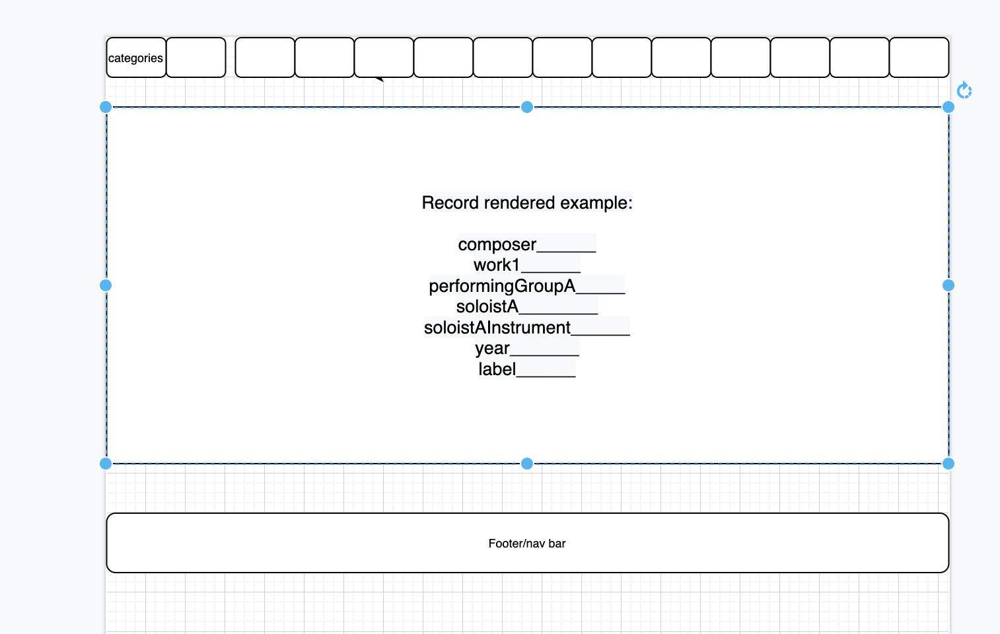

# ckfrecs
## Project Overview

The purpose of this project is to offer a comprehensive database of recommendations of classical music recordings throughout the 20th century (and some of the 21st), from Christopher K. Feltham. Christopher K. Feltham is a veritable encyclopedia on the subject and graciously sat down to provide the first 100 or so recordings for this project.

## Project Name
CKF's Classical Music Recordings Recommendations

## Project Description

CKF's Classical Music Recordings Recommendations is an Airtable and React build from which the user can take advantage of CKF's comprehensive understanding of the base information, and also add recordings. The user can navigate to a second page from the homepage to see the main content, and then from there navigate to a third page to add their own content. They can also navigate directly to the third page to add content from the home page. The home page acts as a landing page and a description. The second page acts as an index page.

## Wireframes

Page 1 (landing page, home page)


Page 2 (table with existing information)


Page 3 (input page for users)


Mobile wireframes


## Component Hierarchy


The reasoning for this is thus:
The form may be the most complicated because these objects are complicated with the numbers of fields they (necessarily) have.
Page 2 is the page navigated to, from the landing page, that shows the existing data, which is complex. Home is the landing page, and Page 3 allows user input (less complicated than Page 2 because I am only allowing 6 fields for that). Nav and buttons will be used over and over and need their own component files.

##API and Data Sample

https://airtable.com/tblWcF11IWSxhrJas/viwKHkxO68t4pcJYP?blocks=hide

EXAMPLE RESPONSE
```javascript
EXAMPLE REQUEST
curl "https://api.airtable.com/v0/appJI9UFGFEJr0WHk/Recordings?maxRecords=3&view=Grid%20view" \
  -H "Authorization: Bearer YOUR_API_KEY"
EXAMPLE RESPONSE
{
    "records": [
        {
            "id": "recOzVBe66S30STI5",
            "fields": {
                "composer": "Bach",
                "work1": "Cello Suites, complete\n",
                "soloistA": "Gendron, Maurice\n",
                "soloistAInstrument": "Cello",
                "label": "Philips"
            },
            "createdTime": "2021-01-19T22:18:19.000Z"
        },
        {
            "id": "rec8QbgKJqhR6tfZJ",
            "fields": {
                "composer": "Bach",
                "work1": "French Suites\n",
                "soloistA": "Schiff\n",
                "soloistAInstrument": "Klav.",
                "label": "London Decca"
            },
            "createdTime": "2021-01-19T22:18:19.000Z"
        },
        {
            "id": "recvoERX2OD5HOtAQ",
            "fields": {
                "composer": "Bach",
                "work1": "Italienisches Konzert\n",
                "work2": "Bach/Busoni transcriptions\n",
                "work3": "Chromatisches Fantasie",
                "soloistA": "Brendel, Alfred\n",
                "soloistAInstrument": "Klav.",
                "label": "Philips"
            },
            "createdTime": "2021-01-19T22:18:19.000Z"
        }
    ],
    "offset": "recvoERX2OD5HOtAQ"
}

```


## MVP/PostMVP

The dataset has fifteen columns. That makes things a bit complicated. However, as far as input from a user is concerned, I think six input items is sufficient (composer, an artist, a label, an orchestra, for example).

MVP: I will have a functioning, nice-to-look-at site with three separate pages and ability for users to input recording data.
Render the data accurately on the pages.
Allow the user to input their own data.


Post-MVP: I will have links to Amazon or some other site for recordings.
Use local storage to save user favorites.
Allow user to choose favorites, or rate recordings.


## Day	Deliverable	Status
| Day          | task                                           | Hours | Hours completed | Hours total |   |
|--------------|------------------------------------------------|-------|-----------------|-------------|---|
| Weds Jan 19  | Proposal pitch, work with airtable and README  | 6     |                 |             |   |
| Thurs Jan 20 | Component creation                             | 6     |                 |             |   |
| Fri Jan 21   | Data setup, functioning of components          | 6     |                 |             |   |
| Sat Jan 22   | Css and layout                                 | 6     |                 |             |   |
| Sun Jan 23   | Css and layout                                 | 6     |                 |             |   |
| Mon Jan 24   | Css and layout, poss. post-MVP                 | 6     |                 |             |   |
| Tue Jan 25   | Post MVP                                       | 6     |                 |             |   |
| Wed Jan 26   | Final work, Deployment                         | 6     |                 |             |   |
| Thu Jan 27   | Presentations                                  | 3     |                 |             |   |


## Timeframes
| Component                   | Priority | Estimated time | Time invested | Actual time |
|-----------------------------|----------|----------------|---------------|-------------|
| Proposal                    | 1        | 6              | 7             |             |
| Airtable setup              | 2        | 2              | 1             |             |
| Buttons                     | 6        | 4              |               |             |
| Data population home        | 3        | 1              |               |             |
| Data population page 2      | 3        | 3              |               |             |
| Data population page 3      | 3        | 3              |               |             |
| Form page 3                 | 4        | 3              |               |             |
| Data creation/update page 1 | 5        | 3              |               |             |
| Data creation/update page 2 | 5        | 3              |               |             |
| Data creation/update page 3 | 5        | 3              |               |             |
| Component css page 1        | 7        | 4              |               |             |
| Component css page 2        | 7        | 4              |               |             |
| Component css page 3        | 7        | 4              |               |             |
|                             |          |                |               |             |
| Total                       |          | 46             |               |             |
|                             |          |                |               |             |
|                             |          |                |               |             |


## SWOT Analysis

Strengths: I feel comfortable with this kind of data from my long experience of having cataloged with it in a library setting. I feel comfortable enough getting data from an airtable and working with it.

Weaknesses: There are a LOT of different kinds of data for this, and I may need to condense the columns or rework them.

Opportunities: The opportunities are numerous for the different kinds of data that can be added in terms of links and sound files, and maybe even videos!

Threats: I am not yet threatened by outside invaders.